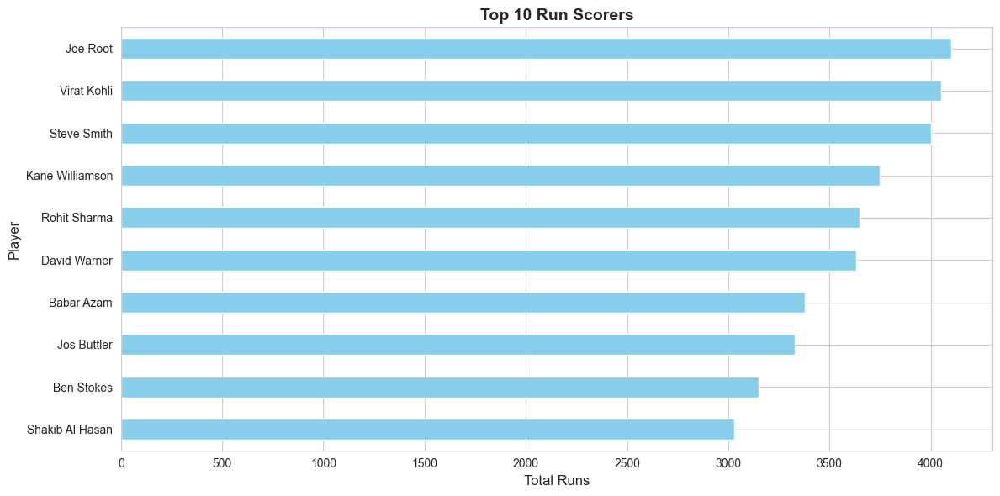

# Cricket Player Performance Analysis

## End-to-End Data Analysis Project

**Goal:** Analyze player and team performance to identify match-winning factors.

**Tools:** Python (Pandas, NumPy), Matplotlib, Seaborn

---

## 📊 Project Overview

This project provides a comprehensive analysis of cricket player performance data to identify key factors that contribute to match wins. The analysis covers batting, bowling, all-rounder performance, and team statistics to derive actionable insights.

## 🎯 Objectives

- Analyze batting performance metrics (runs, average, strike rate, centuries)
- Evaluate bowling performance (wickets, economy, bowling average)
- Identify all-rounder contributions
- Compare team performance and win/loss patterns
- Determine match-winning factors through statistical analysis
- Create comprehensive visualizations for insights

## 📁 Project Structure

```
Data-analysis-GitHub/
├── data/
│   └── cricket_data.csv          # Cricket player performance dataset
├── notebooks/
│   └── cricket_analysis.ipynb    # Interactive Jupyter notebook
├── visualizations/                # Generated charts and graphs
├── cricket_analysis.py            # Main analysis script
├── requirements.txt               # Python dependencies
└── README.md                      # Project documentation
```

## 🚀 Getting Started

### Prerequisites

- Python 3.8 or higher
- pip (Python package manager)

### Installation

1. Clone the repository:
```bash
git clone https://github.com/adityadeshmukh22057/Data-analysis-GitHub.git
cd Data-analysis-GitHub
```

2. Install required packages:
```bash
pip install -r requirements.txt
```

### Running the Analysis

#### Option 1: Python Script

Run the complete analysis:
```bash
python cricket_analysis.py
```

This will:
- Load and analyze the cricket data
- Display statistical summaries
- Perform batting, bowling, and team analyses
- Generate visualizations in the `visualizations/` folder
- Output key insights and findings

#### Option 2: Jupyter Notebook

For interactive analysis:
```bash
jupyter notebook notebooks/cricket_analysis.ipynb
```

## 📈 Analysis Components

### 1. Batting Performance Analysis
- Top run scorers identification
- Batting average and strike rate analysis
- Century and half-century statistics
- Most aggressive batsmen (by strike rate)

### 2. Bowling Performance Analysis
- Top wicket takers
- Best bowling averages
- Economy rate analysis
- Most effective bowlers

### 3. All-Rounder Analysis
- Combined batting and bowling contributions
- Impact score calculation
- Value assessment

### 4. Team Performance Analysis
- Team-wise run totals
- Win/loss records
- Win percentage calculations
- Team comparison metrics

### 5. Match-Winning Factors
- Performance comparison in won vs lost matches
- Key performance indicators (KPIs)
- Role-wise contributions in victories
- Critical success factors

## 📊 Visualizations

The project generates the following visualizations:

1. **Top Performers** - Bar charts of top run scorers and wicket takers
2. **Batting Analysis** - Scatter plot of average vs strike rate
3. **Bowling Analysis** - Bowling average vs economy rate
4. **Team Performance** - Team-wise total runs comparison
5. **Win/Loss Analysis** - Performance metrics in wins vs losses
6. **Role Distribution** - Pie chart of player roles
7. **Correlation Heatmap** - Relationships between performance metrics

### Top 10 Run Scorers



All visualizations are saved in the `visualizations/` directory.

## 🔍 Key Insights

Based on the analysis, the following match-winning factors were identified:

1. **Run Scoring:** Teams score significantly more runs on average in winning matches
2. **Strike Rate:** Higher strike rates correlate strongly with match victories
3. **Bowling Economy:** Lower economy rates lead to better defensive performance
4. **Consistency:** Players with higher batting averages show more reliable performance
5. **All-Rounders:** Players contributing in both batting and bowling provide significant value
6. **Team Balance:** Successful teams have strong performers across all roles

## 📊 Dataset

The dataset (`data/cricket_data.csv`) includes the following features:

- **Player_Name:** Name of the cricket player
- **Team:** Team the player represents
- **Matches:** Number of matches played
- **Innings:** Number of batting innings
- **Runs:** Total runs scored
- **Highest_Score:** Highest individual score
- **Average:** Batting average
- **Strike_Rate:** Batting strike rate
- **Centuries:** Number of centuries (100+ runs)
- **Half_Centuries:** Number of half-centuries (50+ runs)
- **Wickets:** Total wickets taken
- **Bowling_Average:** Bowling average
- **Economy:** Bowling economy rate
- **Best_Bowling:** Best bowling figures
- **Role:** Player role (Batsman, Bowler, All-Rounder, Wicket-Keeper)
- **Match_Result:** Match outcome (Won/Lost)

## 🛠️ Technologies Used

- **Python 3.8+**
- **Pandas:** Data manipulation and analysis
- **NumPy:** Numerical computations
- **Matplotlib:** Data visualization
- **Seaborn:** Statistical data visualization
- **Jupyter:** Interactive analysis environment

## 📝 Future Enhancements

- Add time-series analysis for player performance trends
- Implement machine learning models for match outcome prediction
- Include venue-based performance analysis
- Add opponent-specific statistics
- Create interactive dashboards using Plotly/Dash
- Integrate real-time data updates

## 🤝 Contributing

Contributions are welcome! Please feel free to submit a Pull Request.

## 📄 License

This project is open source and available for educational purposes.

## 👤 Author

**Aditya Deshmukh**
- GitHub: [@adityadeshmukh22057](https://github.com/adityadeshmukh22057)

---

## 📞 Contact

9322053426
.

**Note:** This is a data analysis project for educational and demonstration purposes. The dataset is synthetic and created for analysis practice.
